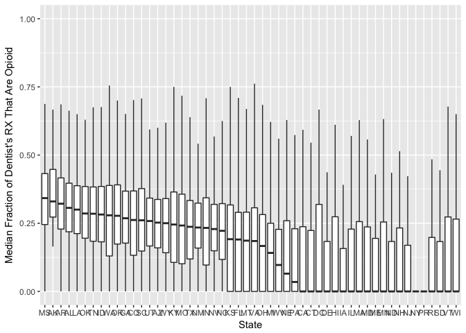
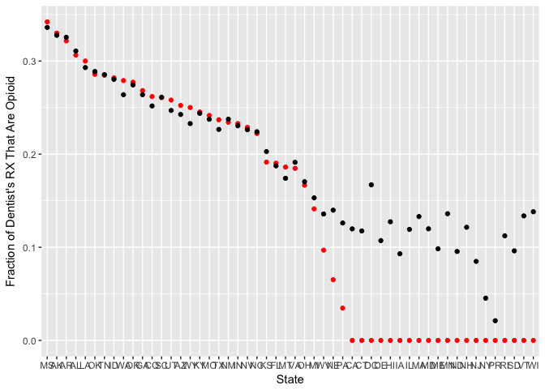
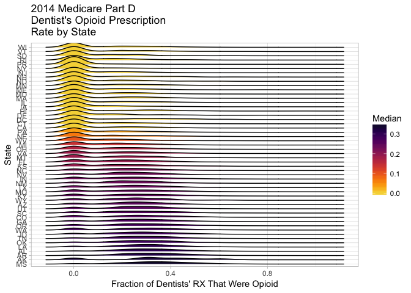
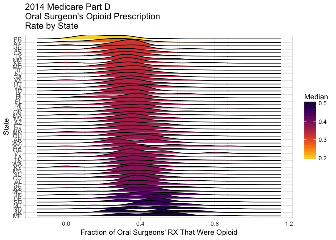
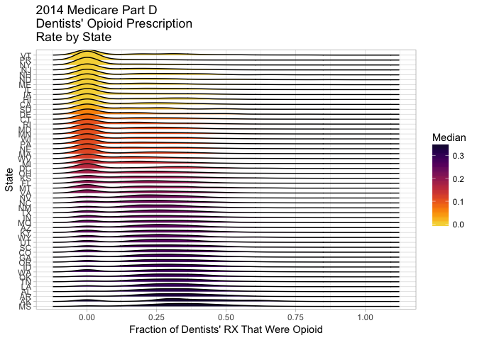

# DentistOpioidMedicareD_2014
Jenny  
9/22/2017  


Load packages


```r
library(tidyverse)
```

```
## Loading tidyverse: ggplot2
## Loading tidyverse: tibble
## Loading tidyverse: tidyr
## Loading tidyverse: readr
## Loading tidyverse: purrr
## Loading tidyverse: dplyr
```

```
## Conflicts with tidy packages ----------------------------------------------
```

```
## filter(): dplyr, stats
## lag():    dplyr, stats
```

```r
library(ggridges)
library(data.table)
```

```
## 
## Attaching package: 'data.table'
```

```
## The following objects are masked from 'package:dplyr':
## 
##     between, first, last
```

```
## The following object is masked from 'package:purrr':
## 
##     transpose
```

```r
library(zipcode)
library(viridis)
```

```
## Loading required package: viridisLite
```

File "Medicare_Part_D_Opioid_Prescriber_Summary_File_2014.csv" downloaded from https://data.cms.gov/Medicare-Claims/Medicare-Part-D-Opioid-Prescriber-Summary-File-201/e4ka-3ncx/data.

Description of the file:

"The Centers for Medicare & Medicaid Services (CMS) has prepared a public data set, the Medicare Part D Opioid Prescriber Summary File, which presents information on the individual opioid prescribing rates of health providers that participate in Medicare Part D program. This file is a prescriber-level data set that provides data on the number and percentage of prescription claims (includes new prescriptions and refills) for opioid drugs, and contains information on each provider’s name, specialty, state, and ZIP code. This summary file was derived from the 2014 Part D Prescriber Summary Table (Documentation available at: https://www.cms.gov/Research-Statistics-Data-and-Systems/Statistics-Trends-and-Reports/Medicare-Provider-Charge-Data/Downloads/Prescriber_Methods.pdf)"

Read in file in data frame format. View first few rows to examine.


```r
opioidRX<-as.data.frame(fread("Medicare_Part_D_Opioid_Prescriber_Summary_File_2014.csv"))

View(head(opioidRX))
```


Fix up the variables:
Make new, clean variable for RX Rate, since `Opioid Prescribing Rate` is a character variable with % at the end. Clean some variable names and change to factor instead of character. Some Zip codes were missing the "0" in front. Use zipcode::clean.zipcodes to fix this for possible map visualization. Rename variable & change from integer to factor variable. 


```r
opioidRX$RXRate <- (opioidRX$`Opioid Claim Count`)/(opioidRX$`Total Claim Count`)

names(opioidRX)[6] = "Specialty"
opioidRX$Specialty <-as.factor(opioidRX$Specialty)
names(opioidRX)[5] ="State"
opioidRX$State <- as.factor(opioidRX$State)

opioidRX$Zip<- as.factor(clean.zipcodes(opioidRX$`NPPES Provider Zip Code`))
```

Include only States, DC, and Puerto Rico. Remove territories or military locations: "XX" "ZZ" "VI" "MP" "GU" "AS" "AP" "AA" "AE". Then remove unused State factor levels.

```r
opioidRX <- subset(opioidRX, State != "XX")
opioidRX <- subset(opioidRX, State != "ZZ")
opioidRX <- subset(opioidRX, State != "VI")
opioidRX <- subset(opioidRX, State != "MP")
opioidRX <- subset(opioidRX, State != "GU")
opioidRX <- subset(opioidRX, State != "AS")
opioidRX <- subset(opioidRX, State != "AP")
opioidRX <- subset(opioidRX, State != "AA")
opioidRX <- subset(opioidRX, State != "AE")
## opioidRX <- subset(opioidRX, State != c("XX" ,"ZZ", "VI", "MP", "GU", "AS", "AP", "AA", "AE"))

opioidRX$State <- droplevels(opioidRX$State)
```

Check distribution of data across States. Might want to add State population size to get ratio of RX/10,000 residents.

```r
table(opioidRX$State)
```

```
## 
##     AK     AL     AR     AZ     CA     CO     CT     DC     DE     FL 
##   2293  13100   8010  21253 111395  18116  16506   4503   3270  63155 
##     GA     HI     IA     ID     IL     IN     KS     KY     LA     MA 
##  26471   4070  10064   4877  43078  19897   9374  14677  15217  33379 
##     MD     ME     MI     MN     MO     MS     MT     NC     ND     NE 
##  21535   5885  38696  20272  20200   8420   3484  32599   2726   6491 
##     NH     NJ     NM     NV     NY     OH     OK     OR     PA     PR 
##   5543  30025   6870   6971  86814  41663  11283  15096  53490  10932 
##     RI     SC     SD     TN     TX     UT     VA     VT     WA     WI 
##   4690  14142   3088  23034  66920   7980  24844   2550  24599  20148 
##     WV     WY 
##   6892   1717
```
Make variable for median RXRate by Specialty. View and rank by Median.

Just look at Dentist, since that category has a high median, surpassed only by various types of oncologists and surgeons. The Dentist category does not appear to include dentists specializing in Oral Surgery, a separate Specialty with a median twice that of Dentist.


```r
opioidRX <- opioidRX %>%
        group_by(Specialty) %>%
        mutate(MedianBySpecialty = median(RXRate, na.rm=TRUE))

MedianBySpecialty <- opioidRX[,c(6,12)][!duplicated(opioidRX[,c(6,12)]), ]
View(MedianBySpecialty)

DentistOpioidRX<-subset(opioidRX, Specialty == "Dentist")
```

Create new variables: median RXRate per State and Zip.


```r
DentistOpioidRXState <- DentistOpioidRX %>%
        group_by(State) %>%
        mutate(Median = median(RXRate, na.rm=TRUE))

DentistOpioidRXZip <- DentistOpioidRX %>%
        group_by(Zip) %>%
        mutate(Median = median(RXRate, na.rm=TRUE))
```

Exploratory plots using State data.

Boxplot with States in descending order by Median RXRate


```r
OpioidBoxPlot <- ggplot(DentistOpioidRXState, 
                            aes(x=reorder(State, -Median), y=RXRate)) +
        geom_boxplot(outlier.colour = "NA") +
        labs(x = "State", y = "Median Fraction of Dentist's RX That Are Opioid")
        

OpioidBoxPlot
```

```
## Warning: Removed 69634 rows containing non-finite values (stat_boxplot).
```

<!-- -->

Scatterplot of State Medians and Means

```r
DentistOpioidMeanMedianPlot <- ggplot(DentistOpioidRXState, 
                            aes(x=reorder(State, -Median), y=RXRate)) +
        stat_summary(fun.y = "median", geom = "point", color = "red") +
        stat_summary(fun.y = "mean", geom = "point", color = "black") +
        labs(x = "State", y = "Fraction of Dentist's RX That Are Opioid")

DentistOpioidMeanMedianPlot
```

```
## Warning: Removed 69634 rows containing non-finite values (stat_summary).

## Warning: Removed 69634 rows containing non-finite values (stat_summary).
```

<!-- -->

Density (ridge) plot per State in descending order of Median RXRate

```r
DentistOpioidRidgePlot <- ggplot(DentistOpioidRXState,
                                 aes(x=RXRate, y=reorder(State, -Median), group=State, fill=Median)) + 
        geom_density_ridges() +  ## geom_joy is now geom_density_ridges
        scale_fill_viridis(discrete = F, option = "B", 
                           direction = -1, begin = .1, end = .9) +
        theme_light() +
        labs(title = "2014 Medicare Part D \nDentist's Opioid Prescription \nRate by State", 
             y = "State", x = "Fraction of Dentists' RX That Were Opioid") 

DentistOpioidRidgePlot
```

```
## Picking joint bandwidth of 0.0383
```

```
## Warning: Removed 69634 rows containing non-finite values
## (stat_density_ridges).
```

<!-- -->

Look at Specialty = `Oral Surgery (dentists only)`

```r
OralSurgeryOpioidRX<-subset(opioidRX, Specialty == "Oral Surgery (dentists only)")

OralSurgeryOpioidRXState <- OralSurgeryOpioidRX %>%
        group_by(State) %>%
        mutate(Median = median(RXRate, na.rm=TRUE))

OralSurgeryOpioidRidgePlot <- ggplot(OralSurgeryOpioidRXState,
                                 aes(x=RXRate, y=reorder(State, -Median), group=State, fill=Median)) + 
        geom_density_ridges() +  ## geom_joy is now geom_density_ridges
        scale_fill_viridis(discrete = F, option = "B", 
                           direction = -1, begin = .1, end = .9) +
        theme_light() +
        labs(title = "2014 Medicare Part D \nOral Surgeon's Opioid Prescription \nRate by State", 
             y = "State", x = "Fraction of Oral Surgeons' RX That Were Opioid") 

OralSurgeryOpioidRidgePlot
```

```
## Picking joint bandwidth of 0.0517
```

```
## Warning: Removed 736 rows containing non-finite values
## (stat_density_ridges).
```

<!-- -->

Combine Dentist and `Oral Surgery (dentists only)`. Patients who have wisdom teeth removed are often prescribed opiates. Dentists perform this surgery but some states may have more Dentists specializing specifically in Oral Surgery and they are listed separately in this data set. Oral Surgeons who are MDs and not dentists are in a separate category and will not be combined with dentists for this analysis.

```r
DentNOralSurgeryOpioidRX<-subset(opioidRX, Specialty %in% 
                                        c("Oral Surgery (dentists only)", "Dentist"))

DentNOralSurgeryOpioidRXState <- DentNOralSurgeryOpioidRX %>%
        group_by(State) %>%
        mutate(Median = median(RXRate, na.rm=TRUE))

DentNOralSurgeryOpioidRidgePlot <- ggplot(DentNOralSurgeryOpioidRXState,
                                 aes(x=RXRate, y=reorder(State, -Median), group=State, fill=Median)) + 
        geom_density_ridges() +  ## geom_joy is now geom_density_ridges
        scale_fill_viridis(discrete = F, option = "B", 
                           direction = -1, begin = .1, end = .9) +
        theme_light() +
        labs(title = "2014 Medicare Part D \nDentists' Opioid Prescription \nRate by State", 
             y = "State", x = "Fraction of Dentists' RX That Were Opioid") 

DentNOralSurgeryOpioidRidgePlot
```

```
## Picking joint bandwidth of 0.0404
```

```
## Warning: Removed 70370 rows containing non-finite values
## (stat_density_ridges).
```

<!-- -->

